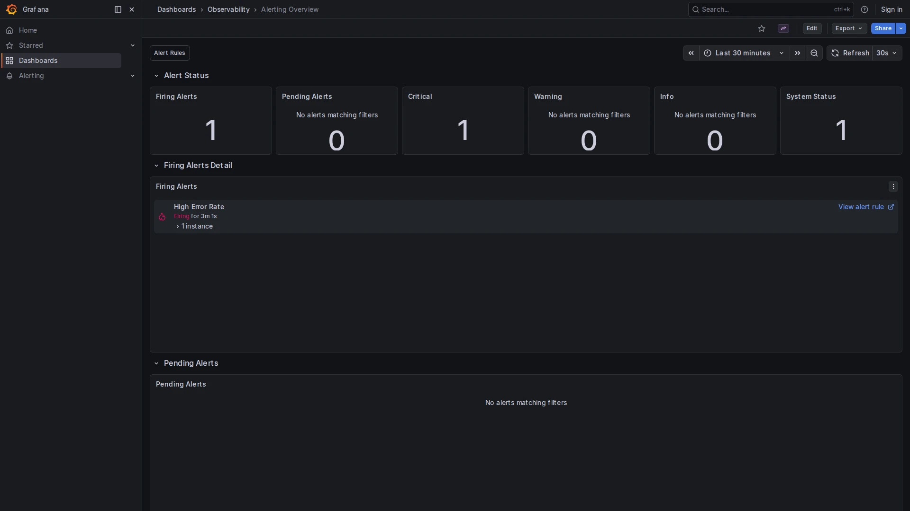

# Alerting Overview

**Path:** `Dashboards → Observability → Alerting Overview`  
**Datasources:** Grafana (alertlist), Loki (state history)  
**Refresh:** 30s  
**Tags:** `alerting`, `observability`

## Purpose

The Alerting Overview shows the current state of all Grafana alert rules at a glance. It provides a severity breakdown and detailed lists of currently firing and pending alerts, plus a historical view of past state transitions backed by Loki.

This dashboard complements the built-in `Alerting → Alert rules` page with a persistent, embeddable view — useful for on-call runbooks or NOC screens.

---

## How Grafana Alerting Works

Grafana Unified Alerting evaluates rules on a schedule. Each rule passes through three states:

| State | Meaning |
|-------|---------|
| **Normal** | Condition not met |
| **Pending** | Condition met, waiting for the `for` duration to elapse |
| **Firing** | Condition sustained for `for` — notifications dispatched |

State transitions are recorded as structured log entries in Loki (`from="state-history"`), enabling historical queries even after an alert resolves.

---

## Panels

### Alert Status row

| Panel | Type | Description |
|-------|------|-------------|
| **Firing Alerts** | alertlist (stat) | Count of currently firing rules; turns red when ≥ 1 |
| **Pending Alerts** | alertlist (stat) | Count of rules in pending state |
| **Critical** | alertlist (stat) | Firing rules with label `severity=critical` |
| **System Status** | alertlist (stat) | Shows `1` when any alert is firing |

All panels use the native Grafana alertlist panel type, which reads directly from Grafana Unified Alerting state — no external metric store required.

---

### Firing Alerts Detail row

**Firing Alerts (list)** — full detail list of firing alerts with alert name, state duration, and a link to the rule definition.

**Pending Alerts (list)** — same layout for pending alerts. Pending alerts are early warnings — they may self-resolve or escalate to firing within the `for` window.

---

### Alert History row

Powered by Loki state history (`GF_UNIFIED_ALERTING_STATE_HISTORY_BACKEND=loki`). Every state transition is written as a structured JSON log entry.

| Panel | Query | Description |
|-------|-------|-------------|
| **Alert Firings Over Time** | `sum by (ruleUID) (count_over_time({from="state-history"} \| json \| current="Alerting" [$__range]))` | Bar chart of firing transitions per rule; grouped by `ruleUID`; window adapts to the selected time range |
| **Recent Alert State Changes** | `{from="state-history"} \| json \| line_format "[{{.current}}] {{.ruleUID}} (was: {{.previous}})"` | Log of all transitions (Normal → Pending → Alerting → Normal) |

> **Note:** Grafana UA writes to Loki only on state transitions, not continuously. Use a time range of at least 1 hour to see past events. `[$__range]` makes the count window adapt automatically to the dashboard time picker.

> The Alert History panels require `GF_UNIFIED_ALERTING_STATE_HISTORY_BACKEND=loki` and `GF_UNIFIED_ALERTING_STATE_HISTORY_LOKI_REMOTE_URL` set in Grafana's environment (already configured in `docker-compose.yml`).

---

## Pre-configured Alert Rules

The following rules are provisioned in `provisioning/alerting/rules.yaml`:

| Rule | Condition | Severity | `for` | `noDataState` |
|------|-----------|----------|-------|---------------|
| **High Error Rate** | Error rate > 2% (all span kinds) | critical | 5m | NoData |
| **High Latency (p99)** | p99 > 2s, broken down per `service_name` | warning | 5m | NoData |
| **Service Down** | No SERVER spans received | critical | 5m | Alerting |
| **Collector Dropping Spans** | Dropped spans > 0 | warning | 2m | Alerting |
| **Collector Queue High** | Queue > 80% capacity | warning | 2m | Alerting |
| **High Log Error Rate** | Log error entries > 1/s | warning | 5m | NoData |

> **Service Down** and the two Collector rules use `noDataState: Alerting` — they fire when metrics stop arriving entirely, not just when a threshold is crossed. This catches cases where the collector itself goes down.

> **High Error Rate** counts all span kinds (CLIENT + SERVER). MockMart outbound calls are `SPAN_KIND_CLIENT` — filtering to `SPAN_KIND_SERVER` only would miss them.

> **High Latency (p99)** fires one alert instance per service that exceeds 2s. The description includes `{{ $labels.service_name }}` to identify the offending service.

> **High Log Error Rate** uses Loki as datasource with a metric query (`detected_level="error"`). It catches application errors that don't produce span errors (background jobs, startup failures, etc.).

---

## How to Use

1. Open the dashboard with **time range = Last 30 minutes** for a real-time view.
2. If a critical alert is firing, click **View alert rule** in the Firing Alerts panel to see the full rule definition and evaluation history.
3. Scroll down to **Alert History** to see when the alert first fired and whether it has toggled.
4. Use **Traces Explorer** or **Logs Explorer** to investigate the root cause.
5. To add notification channels (Slack, email, PagerDuty): see [ALERTING.md](../ALERTING.md).

---

## Silencing an Alert

To silence a firing alert during maintenance:

1. Go to `Alerting → Silences → Add silence`.
2. Match the alert by label (e.g., `alertname="High Error Rate"`).
3. Set the duration and add a comment.

Silences suppress notifications but the alert remains visible in this dashboard.

---

## Related Dashboards

- [Service Overview](service-overview.md) — source of the High Error Rate and High Latency metrics
- [OTel Collector Health](otel-collector-health.md) — source of the Collector Dropping / Queue alerts
- [SLO Dashboard](slo-dashboard.md) — measure the impact of a firing alert on the error budget
